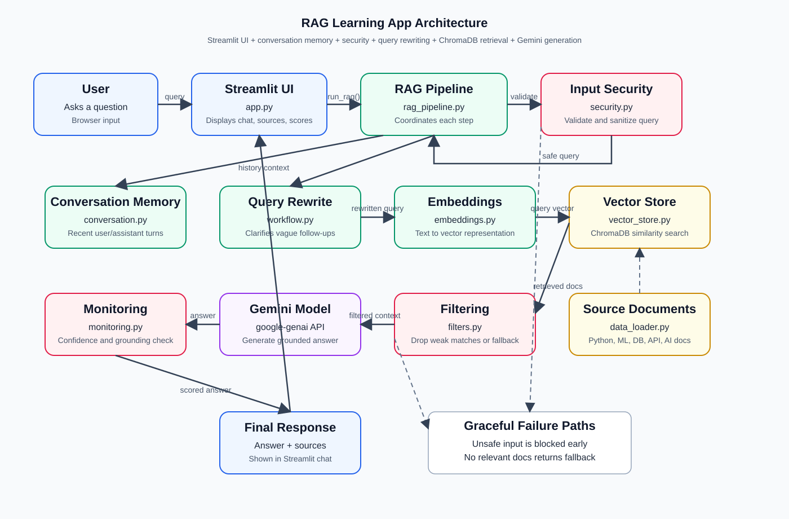

# RAG App Architecture

This diagram shows the high-level flow of the RAG Learning App. The system starts with a user question in the Streamlit interface, validates it, improves it for retrieval, searches relevant documents, generates an answer with Gemini, and displays the response with sources and quality signals.

## Component Overview

- `app.py`: Provides the Streamlit chat interface. It accepts user questions, displays assistant answers, shows retrieved sources, and renders confidence and grounding information.
- `rag_pipeline.py`: Coordinates the end-to-end RAG workflow. It connects validation, rewriting, retrieval, filtering, generation, monitoring, and conversation history.
- `security.py`: Validates input before any retrieval or LLM call. It blocks empty, overly long, or prompt-injection-style queries.
- `conversation.py`: Stores recent user and assistant messages so follow-up questions can use conversation context.
- `workflow.py`: Rewrites vague questions into clearer search queries and can decompose complex questions into simpler sub-questions.
- `embeddings.py`: Converts text queries and documents into vector embeddings using SentenceTransformers.
- `vector_store.py`: Stores and searches embeddings with ChromaDB so the app can retrieve semantically similar source documents.
- `data_loader.py`: Provides the sample knowledge base documents about Python, machine learning, databases, APIs, cloud, and AI concepts.
- `filters.py`: Removes retrieved documents that are not similar enough and returns a fallback message when nothing relevant is found.
- `monitoring.py`: Calculates confidence from retrieval distances and checks whether Gemini's answer is grounded in the source documents.
- Gemini API: Generates the final answer using the retrieved context and current question.

## Data Flow

1. The user enters a question in the Streamlit UI.
2. `run_rag()` validates and sanitizes the question with `security.py`.
3. Recent conversation history is formatted by `conversation.py`.
4. `workflow.py` rewrites the query using the original question and conversation context.
5. `embeddings.py` converts the rewritten query into a vector.
6. `vector_store.py` searches ChromaDB for similar documents.
7. `filters.py` removes weak matches. If no relevant documents remain, the app returns a fallback response instead of calling Gemini.
8. Gemini receives the current question, conversation history, and filtered source documents, then generates an answer.
9. `monitoring.py` scores confidence and checks grounding.
10. `app.py` displays the answer, sources, confidence score, and grounding label.

The editable Excalidraw source file is available at `docs/rag-app-architecture-diagram.excalidraw`.
